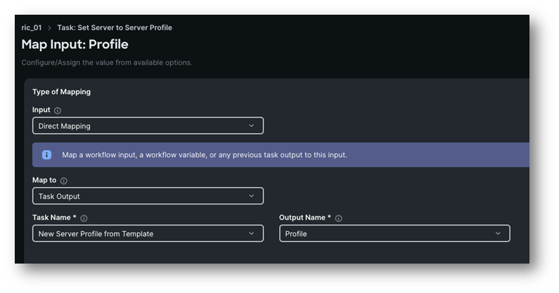
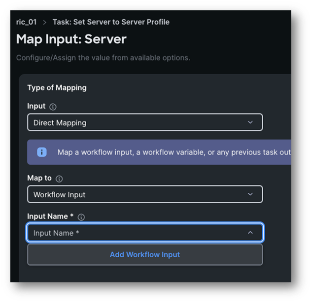
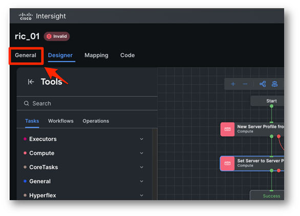
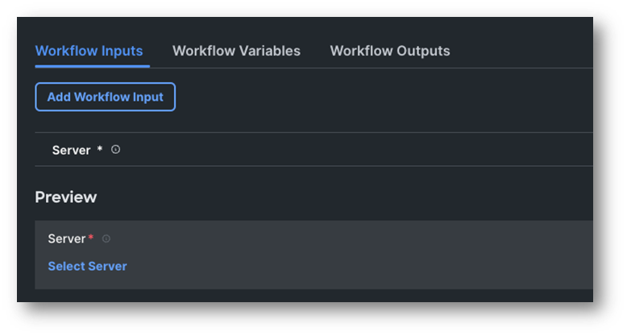
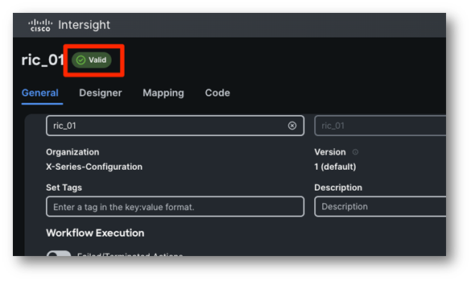
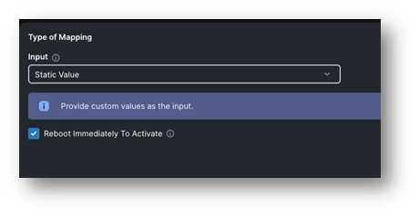
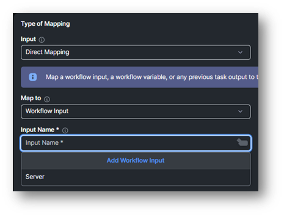
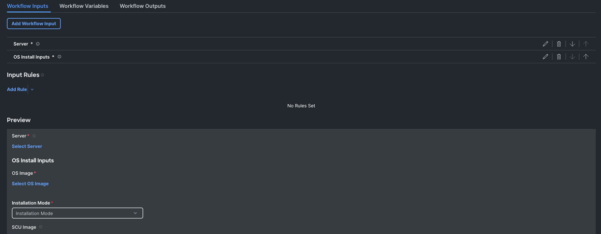
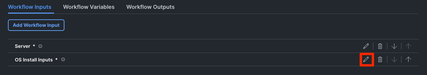
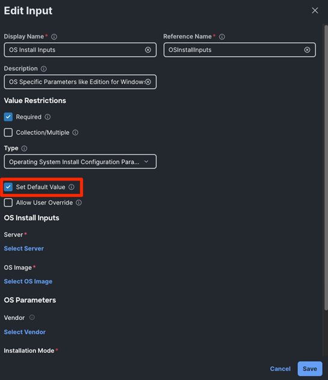

# Task 2: Compose The Workflow

Switch to the **Designer** tab.
On the left, under Tools, you can see three subtabs:

* **Tasks**: Contains the list of system and non-system (custom) tasks by category. A task is an atomic action you can perform against a target (i.e. create server profile, deploy new virtual machine, etc.)

* **Workflows**: Contains the list of workflows that can be used as tasks (nested workflows) within a larger workflow. In this case, workflow inputs are treated as task inputs and workflow outputs are treated as task outputs

* **Operations**: At the moment, Intersight automation offers three special tasks:
    * **Conditional Task**: This task allows the creation of multiple branches that can be followed at execution runtime based on configured condition. An example would be taking different path based on a task output or a user choice
    * **Parallel Loop**: This is a container task, whatever task gets dropped into this task, it will be execute n times in a parallel fashion. Where n is a configurable integer or can be rendered with a configuration template dynamically
    * **Serial Loop**: This is a container task, tasks within this task will be executed sequentially until a counter expires or a configured condition is met. An example would be: "execute all tasks serially until the output of this task is "foo"

Move to the **Tasks** subtab.

Search the task **New Server Profile from Template** and drag it to the canvas as shown below:

Click the task and note a new panel has opened on the right, as shown below:

These are the properties of the task. Each task comes with **Input, Outputs** and can handle (use or manipulate) **Variables**.

Under **General**, you can set the task name and a description. For this lab, we will leave it as it is.

Move to the **Inputs** tab.

You can see a list of inputs, specific for this task. Each input can be mandatory or optional

This specific task has only one mandatory input, which is **Source Profile Template**, basically what is the template we will derive a server profile from.
Let's go ahead and assign or **Map**, a value to this input. For the **Source Profile Template** input, click the **Map** button.

The form defaults to a **Static Value** type of mapping. However, we generally have three different types of mappings. Let's explore them:

* **Static Value**: Assigns a value that will always be honoured at every execution. Based on the input type, you have the possibility to query the Intersight database (like in this case, where you can pull the list of all server profile templates configured for your account), set an arbitrary text string, set a number (Integer), etc.

* **Direct Mapping**: Maps the value to either a Workflow Input, another Task output (which has to be positioned in the canvas before the current task), a Workflow Variable or an Environment Variable

* **Advanced Mapping**: Is a way for advanced users to write Go template code in order to map values dynamically based on custom code. As mentioned, this is an advanced topic and out of scope for this lab.

For this input, we will go ahead and perform a static mapping.
Under **Type of Mapping** select **Static Value**.

Click on **Select Source Profile Template** to get the list of the configured profile templates as shown in the picture below.

Select your student profile template “SRVxx-ServerProfileTemplate” then click **Select** in the bottom right corner.

Click **Map** in the bottom right corner to confirm.

Let's stop for a second and explore the anatomy of a task.
You know that each task has inputs, outputs, the possibility to consume variables, a name and a description.
Each task has also two exit conditions as you can see in the screenshot below:

By connecting these green and red dots, you can create paths based on your use case, for instance you can decide to execute a specific task if a previous task fails.
Eventually, the workflow either fails or succeeds based on the outcomes of all tasks.

Now that we instructed the workflow to create a server profile out of a template, we want to map the created template to a server.
In the **Tools** panel on the left side, search for the task **Set Server to Server Profile**. As soon as you start dragging the task under the **New Server Profile from Template** task, a green plus sign will appear. If you release the task over the plus sign, it will automatically be connected to the success line (the green line) of the **New Server Profile from Template** task as shown below:

Click on the **Auto Align Workflow** button to automatically align the tasks:

Before moving forward with the inputs, let's see how Intersight validates and saves the workflows.

Click the **Save** button in the top right corner.
When you **Save** a workflow, Intersight will perform two actions:

* Save the workflow definition
* Validate the workflow

The green banner indicates the workflow has been saved:

However, you can also see there are 2 errors found! and the workflow transitioned into the **Invalid** state:

What's the problem here?
The **Set Server to Server Profile** task is used in the workflow but it has two mandatory inputs (**Profile** and **Server**) to which we have not assigned a value.
This means the workflow cannot be executed, although saved successfully.
Let's fix this and move forward with the workflow definition, let's assign a value to the **Profile** and **Server** inputs for the **Set Server to Server Profile task**.

For the **Profile** input, click on **Map**.
This time we are using a different type of mapping: **Direct Mapping**. As mentioned, we can make this value dynamic, so we are going to map this value to the **Profile** output of the **New Server Profile from Template** task. After all, we can't know the ID of the new profile in advance before it gets created!

* **Input**: Direct Mapping
* **Map To**: Task Output
* **Task Name**: New Server Profile From Template

As usual, click on the **Map** button in the bottom right corner to confirm the mapping.

For the **Server** Input, we will again use **Direct Mapping**, however this time we will create a **Workflow Input** inline, as we want the user to specify what is the target server before the workflow gets executed.

Click on the **Map** button, then select **Direct Mapping**, **Workflow Input**, **Add Workflow Input** as shown below:

A new form will open.
You can notice all fields have been automatically filled with the right values based on the input type.
Understanding all fields of this specific data type is out of scope for this lab. If you want you can have a look, when done click on the **Add** button

Final result:

* **Input**: Direct Mapping
* **Map To**: Workflow Input
* **Input Name**: Server

Click **Map** at the bottom right corner to confirm.

You should now be moved to the canvas again. Let's have a look at the **General** tab of the workflow:

Under **Workflow Input** you can now see the new input we just created. You can also check the **Preview** section, which shows a preview of the user experience at workflow execution, where in this case they can only specify a **Server** before starting the workflow execution.

Let's **Save** again. All errors disappeared and the workflow transitioned to the **Valid** state. This means that we can execute it! ...but not just yet :)

Now that you are familiar on how to use tasks and map their inputs, let's speed things up.

* In Designer, drag the **Deploy Server Profile** task **after** the **Set Server to Server Profile** task
* Inputs:
    * **Profile**: Direct mapping to the **Task Output: New Server Profile from Template** task, Profile output
        * **Input**: Direct Mapping
        * **Map To**: Task Output
        * **Task Name**: New Server Profile From Template
        * **Output Name**: Profile
    * **Reboot Immediately to Activate**: Static value and check the option. This will apply all changes before we move forward with the Operating System Install
        * **Input**: Static Value
        * **Reboot Immediately To Activate**: Checked

* In the **Tools** panel, click on **Workflows** and drag the **Operating System Install** task (nested workflow) after the **Deploy Server Profile** task
* Here are the Operating System Install task Inputs:
    * **Server**: Direct mapping to the **Server** workflow input
        * **Input**: Direct Mapping
        * **Map To**: Workflow Input
        * **Input Name**: Server
    * **OS Install Inputs**: create a new workflow input using **Direct Mapping** as you have done for the **Server** input on the **Set Server to Server Profile** task.
        * **Input**: Direct Mapping
        * **Map To**: Workflow Input
        * Click on “**Add Workflow Input**”

* Click **Add**
* **Map** it
* **Save** the workflow and it should be valid again

Move back to the **General** tab of the workflow, you should now have something like this:

In theory, we can now execute the workflow, however if you have a look at the **Preview** section at the bottom section, there is a ton of inputs to fill in! Sometimes, we want to simplify workflow definition and spare our users to provide unnecessary inputs. In a real-world scenario, this depends on who is supposed to execute workflows: power users may want to specify all bits and bytes, while entry level engineers may not even have the necessary domain knowledge, so we only expose a limited set of inputs.

For this lab, let's use a specific feature for **Workflow Inputs**: default values.

Edit the **OS Install Inputs** workflow input by clicking on the pen icon behind it:

Check **Set Default Value** option:

Basically, here you can set some defaults for our target users. In this specific case, those inputs will not even exposed. If you check the **Allow User Override** option as well, the default value will still be set but it will also be visible, and the user can override the value.
In our case, we will leave the **Allow User Override** option **unchecked**.

Let's set default values for the following sub-inputs, it works just like the **Static Value** input type mapping you already had the chance to work with:

* **OS Image**: ESXi 8.0u1a
* **Vendor**: VMware
* **Installation Mode**: Cisco
* **Vendor**: VMware
* **NetworkDevice** (the management interface which will receive the mgt IP address): vmnic0
* **SCU Image**: ucs-scu-6.3.2c.iso

Click **Save** when done, then **Save** again in the top right corner to save and validate the workflow.
In the **Preview** section, you can now see that we have much less inputs!

Let's go ahead and execute the workflow.