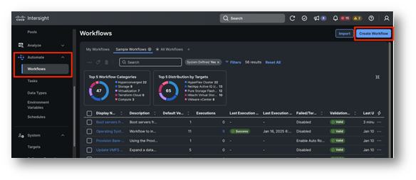

# Task 1: Create A New Workflow

From Intersight, under **Automate** click on **Workflows**, then **Create Workflow**.
You will be brought to the **General** tab of the workflow designer, which is the first of four tabs.

Let's describe what those tabs are used for:

* **General**: This is where you configure overall specs for your workflow, such as display name, tags, organization, description as well as inputs, outputs and variables

* **Designer**: This is the design canvas, where you can drag and drop tasks like "Lego bricks" to create a service blueprint, that is a workflow

* **Mapping**: Here you can view or edit the mappings among tasks and/or workflow inputs of outputs in a graphical way

* **Code**: From here, you can have a live code representation of the workflow you are creating. This is useful for troubleshooting purposes or for advanced topics, out of scope for this lab.

You should be in the **General** tab. As mentioned, this is where you can specify the specs of your workflow:

* **Display Name**: Is a friendly name that can be changed at any time. 
    * **Value**: Assign an arbitrary name, preferably in the format "workflow _<POD_number>"

* **Reference Name**: Is the workflow name as seen by the system, this needs to be unique and can't be changed once set. It defaults to the **Display Name** but can only contain letters (a-z, A-Z), numbers (0-9), hyphen (-), period (.) or an underscore (_)
    * **Value**: Keep the default value as it's rendered after you specified the **Display Name**

* **Organization**: Is the organization this workflow belongs to
    * **Value**: Ensure you are using the **organization "X-Series-Configuration**"

* Under **Workflow Execution** you will find a switch called **Failed/Terminated Actions**. This allows the user to set whether to enable retry for workflow executions or enable automatic rollback in case of failure. This is especially useful when you want to rollback succeeded tasks in a failed workflow execution to get back to a clean state. Automatic Rollback can be enabled for workflow that failed, get cancelled or both
    * **Value**: We don't need this for the lab, keep the switch **OFF**

* **Enable Debug Logs**: When true, workflow debug log info will be generated for each task. Enabling this flag will capture request and response details as debug logs in Intersight.
    * **Value**: **Check** to switch it **ON**

* **Workflow Inputs**: Are data placeholders the users will populate when executing the workflow. For instance, this could be a server selection, a virtual machine name or any data you want your users to provide for a specific workflow execution
    * **Value**: Ignore for now, we will create workflow inputs using another strategy, inline when doing mapping at the task level

* **Workflow Variables**: Are data placeholders that can be used by tasks to update information. These variables can be mapped to workflow outputs or reused as inputs by other tasks.
    * **Value**: Ignore for now, we won't use workflow variables in this lab

* **Workflow Outputs** are data placeholders that will return outputs to the users after the execution. In case of nested workflows (workflows used as tasks in larger workflows) these can be used as inputs for other tasks or workflows
    * **Value**: Ignore for now, we will create workflow outputs using another strategy, inline when doing mapping at the task level