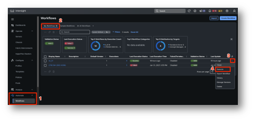
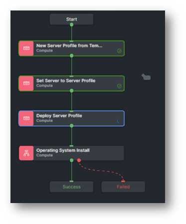
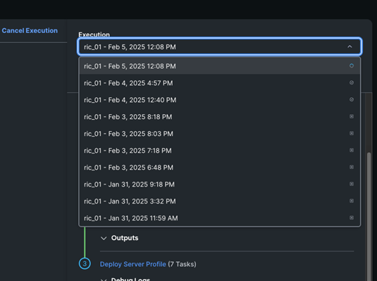
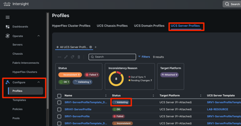
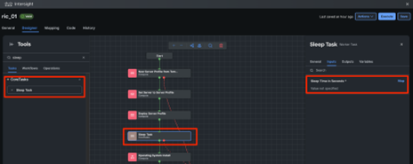
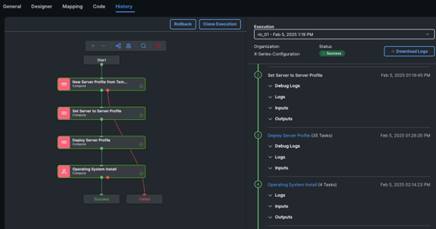

# Task 3: Execute The Workflow

There are several ways to execute a workflow (please just READ, in this lab we are going to document only one of the following ways:

* From the **Automate**, **Workflow** Intersight section (**Workflow Designer**), clicking the context button, then **Execute**
* Within the workflow itself, using the **Execute** button
* **Scheduling** the workflow execution instead of executing right away. We support two types of workflow execution scheduling:
* One time. You can define execution time and date
* Recurring, using the **Repeats** option. Here you can set the first execution time as well as the start time cadence (Daily, Weekly, Monthly, etc.) and the end time condition (Never, on a specific day or after an arbitrary number of executions). You can also specify the minimum failure threshold, that is the number of failed executions the system can tolerate before suspending the schedule (manual intervention will be required)

For this lab, we are going to execute the workflow from the **Workflow Designer**.

If you are not already there, navigate to **Automate**, **Workflows**, **My Workflows**.
Then click on the context button of your workflow and **Execute** the workflow as shown below:

These are the inputs we decided to expose to the users. Go ahead and fill the inputs with the following values. If not specified, leave it blank or keep the default:

* **Organization**: X-Series-Configuration
* **Server**: The server you have assigned. Please make sure you are not selecting someone else's server or it will compromise the rest of the lab for everyone.
If you scroll to the right, the user label is visible.
**One note**: as you select the server, also copy its name, it will be easier for the next input as you need to specify the server twice.

Click **Select**

* This is how we coded the workflow and there is a way to expose this input only once. However, this will require more advanced capabilities like Go Templates which are out of scope for this lab
* **Server**: This is the second time you specify the server, copy the server name you used before in the search, it will be easier to retrieve among all the others. This time the user label is not visible.
Make sure both of the server names are the same and corresponding with the server name on your **User Work Sheet**.

* **VLAN ID**: Leave it empty as the traffic will be untagged
* **IP configuration Type**: DHCP
* **DHCP IP Version Type**: IPv4
* **Hostname**: This is arbitrary. If possible use the SRVxx, where x is your POD number.
* **Root**: Although arbitrary as well, if possible use UCSX@Cisco123 which is the password for your account. This way in case of problems, proctors can easily help you
* **Target Disk Type**: Local Disk

Click on **Execute**. The workflow will take approximately 55 minutes to complete.

In the meanwhile, let's monitor its execution.

If you are already on the history tab you can ignore this part.
From the **Workflow Designer**, click on your workflow to edit it.
You will notice the last tab, called **History**. Click it.

On the left side, you will see your workflow tasks and progress tracking, so you know what is the current task being executed.

On the right side, you have a drop down which is set to the latest execution (the one you just triggered). If you had executed this workflow in the past, you will have the chance to "go back in time" and check inputs, outputs and outcomes of past workflow, like shown below:

Feel free to explore, **Workflow Logs**, **Workflow Inputs** and task specific **Logs**, **Inputs** and **Outputs** as the workflow gets executed. Eventually, when the workflow will finish with success, you will also have access to **Workflow Outputs**, which in this case we haven't set any.

Although the workflow has just started, we can start checking its effects on the system as it runs. Click on the **X** button in the top-right corner to exit the workflow view.

You will notice a spinning wheel with a number in the top-right corner, this is the number of running workflow in this moment. By clicking on it, you will see a different view which shows **In Progress** workflows. Click on your workflow (by default it will have the name of the workflow, unless you have changed it at execution time).
From here, you can have more details on the workflow execution, including its execution time and other useful metadata. Feel free to explore, when done, exit this view by clicking the **X** button.

Of course the operating system hasn't been installed yet, but more than likely we already have our profiles derived from the template and deployed to your server. Let's have a look.

Navigate to **Configure**, **Profiles**, **UCS Server Profiles** as shown below:

From here, you can see that a new server profile has been already derived from the template and it's currently **Validating**.

**NOTE:**  
It is possible, due to rare race conditions, that the OS install will fail as the server will try to mount the image before the server profile finishes activation. If this is your case, you will notice it after 7-8 minutes from the execution. A solution could be to have a **Sleep Task** (Under Tools, Tasks, CoreTasks) right before the **Operating System Install** task. You can set a value of 600 seconds (10 minutes) to ensure the **Operating System Install** tasks gets executed after the server profile has been activated:

If you are adding this step AFTER the workflow has failed, make sure to unassign the server profile to your server.

Feel free to monitor the workflow as it runs or just have a break! 
This is the expected outcome after approximately 50-55 minutes:

