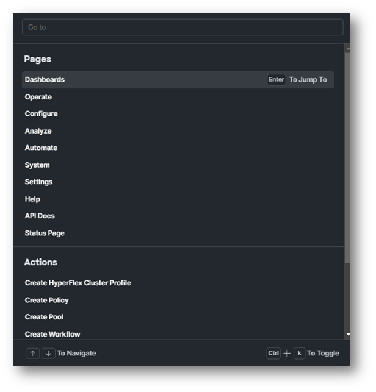
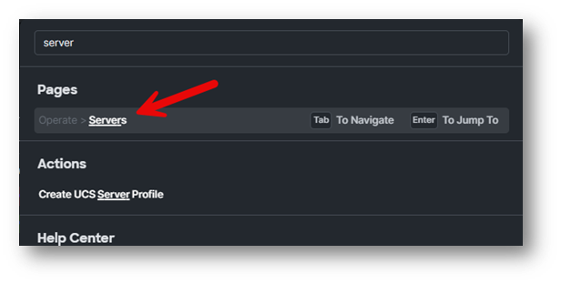
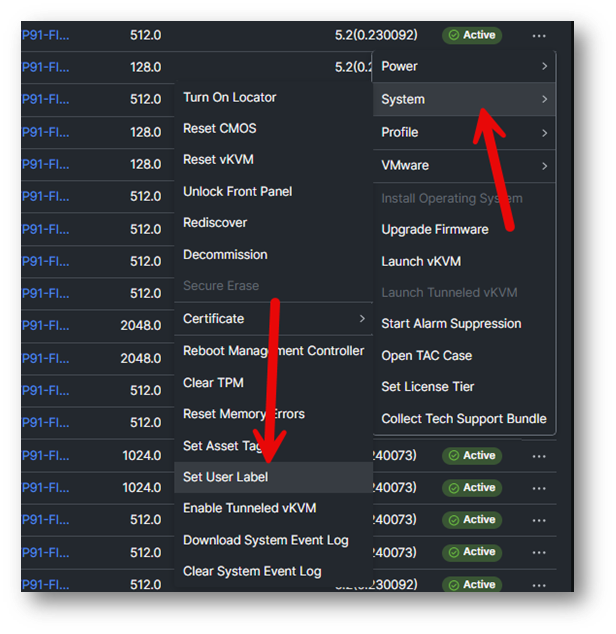
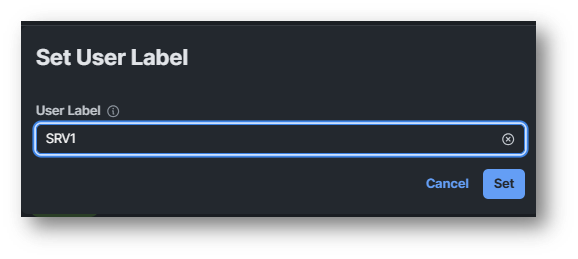
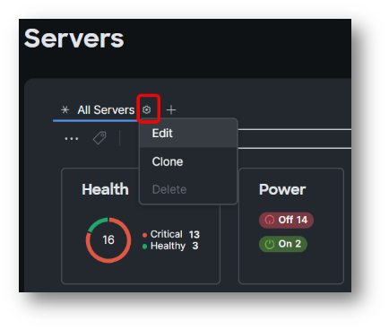
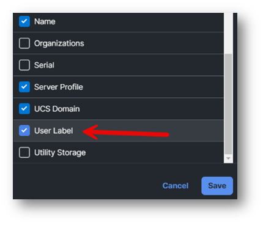
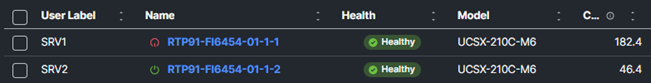

# Task 2: Command Palette / User Label

To navigate Intersight in an easy way, you can use the Command Palette.
Press **CTRL-K** to open the Command Palette.
It looks like the following figure.

Search for server.

Click on **Operate > Servers**

The server names can be confusing, and one solution is to work with User Labels.
First find the server which is assigned to you, this is written on your User Detail Worksheet. 
Click on the three dots next to your server.

Select **System -> Set User Label**

Set the User Label to **SRVx**, which is the <<User Label>> that you can find on your User Details Worksheet

This will make it easier to find your server.

At this moment, it is possible you don’t see the user labels at the server overview.
Click **Settings** next to server and select **edit**

Scroll down and select **User Label** and hit **save**.

Now you see the User Label and you can filter on it or move it to the first column.

