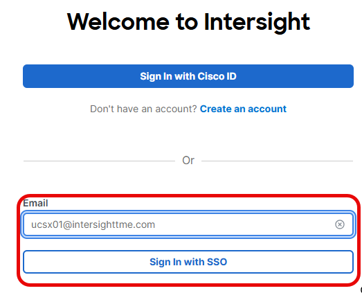
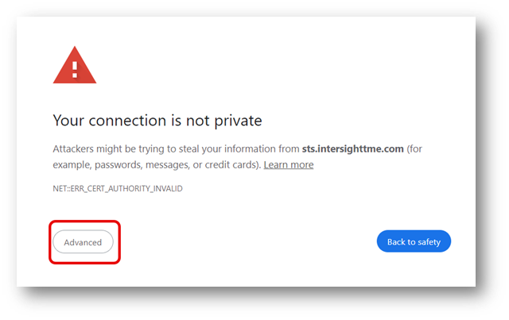
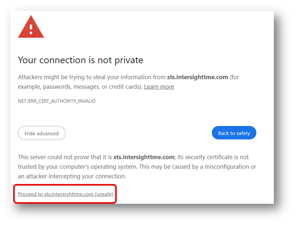
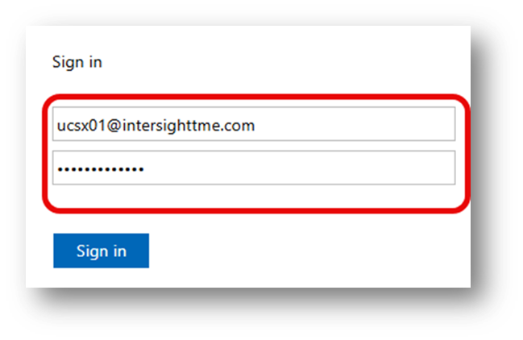
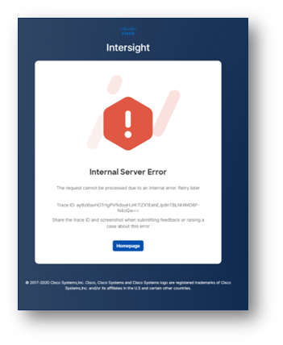
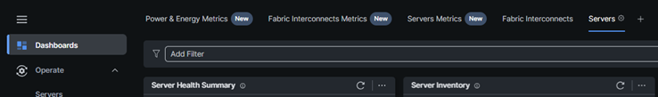

# Task 1: Connect To Intersight

You can connect with the laptop to Intersight and do all tasks in this lab.
For this lab, every participant will have one physical server to configure.

**NOTE:**
**DO NOT CHANGE THE CHASSIS or DOMAIN POLICIES.**
7 Persons next to you won’t be able to work on their lab.

The lab gear consists of 4 clusters which exist of an FI pair, a UCSX-9508 chassis and 8x UCSX-210c-M6 nodes, all connecting to a top of rack switch. 

**NOTE:**
Servers can have different CPUs, memory and Storage configuration. Even though these differences, every server has an M.2 drive to install the OS on and every task will work on any server.

## Connecting to the Lab Components

In this lab activity, you will use the provided credentials to log into the Intersight account you’ll be using for the lab.

In the web browser, navigate to: [Intersight](https://intersight.com). You will see the following screen:

On your **“User Details Worksheet”** find your unique username which is designated as **[[Username]]** and use the email **[[Username]]@intersighttme.com** to login to Intersight.

It is possible that you see the following message, this is normal as we are using unsigned certificates as part of the lab environment.

Click on **Advanced.**

Then click **“Proceed to sts.intersighttme.com (unsafe)”.**

On the “sts.intersighttme.com” login screen, enter **[[Username]]@intersighttme.com** as the email address again and enter the **[[Password]]** from the **User Details Worksheet.**

The following Table has the information about the login for Intersight.

**NOTE:**
DO NOT USE THIS FOR THE VPN. Use your User Details Worksheet.

If you see this error message below, please try to login again.

When logging into Intersight as a specific user, Intersight will return you to the last page you were viewing the last time you were logged in.

Click on **Dashboards** on the left and then click on **Servers** at the top.

This is the start for everyone.