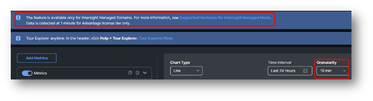

# Task 2: Explorer

Explorer is a new feature in Intersight. It will give you metrics about different devices and parameters.

During the creation of this document, the whole environment wasn’t up and running, and therefore, you don’t see much traffic/values in the following screenshots.

This Explorer feature will improve and more will be added.

On the right side, select Explorer.

**Note**:
Keep in mind, when you have the Advantage License Tier option, the data is collected every minute, but the granularity is still at 10 min.

For the first metrics, we are selecting:  
**Host Power and Status** -> **Host Power** -> **Maximum**

Click on “Group By” and select **Host Name**

Select a time interval of Last Month to see nicer graphs.

Here is the current result:

The limit is already set to 5.

If you want to see the 8 FI set the limit to 8.

And here is the result where you see the 8 FI’s.

**Disable** this metric (Slide next to “**Host Power – Maximum**” and **Add Metric** for a new metric.

Select:

* **Network Interface** -> **Operational Link Speed** -> **Maximum**
* **Filter By**: Host Type equals Fabric Interconnect
* **Group By**: Host Name
* **Limit**: 5

The result you see are in **Bps** (Bytes per Second.)

This is for every network related metric. Keep this in mind that it is NOT bps (bits per second.)

In this case the Max link is 25 GBps or 200 Gbps.

To find the power usage of one chassis, you need to know the chassis identifier.

One easy way to get this, is to go to the Chassis you want to know the details and select metrics.

On the left, go to **Operate** -> **Chassis** / Select **RTP91-FI6454-04-1** (Chassis name) / Click **Metrics**. (On the top)

Look for the **Power** with PSU1 as Endpoint.

Expand it and click on **View in Explorer**

Click on **Filter By** and you will see:

The right Identifier is now chosen, but there is only one PSU and we want to have all PSUs to see the power consumption of the chassis.

**Remove** the **Name = PSU1** and type in that field **Name**. Then select name and select **contains**.

Instead of choosing a PSU from the list, type **PSU** and hit enter.

Now you see the power consumption of the total chassis.
If you select a time interval of one week, you can see that we had issues in the lab.

