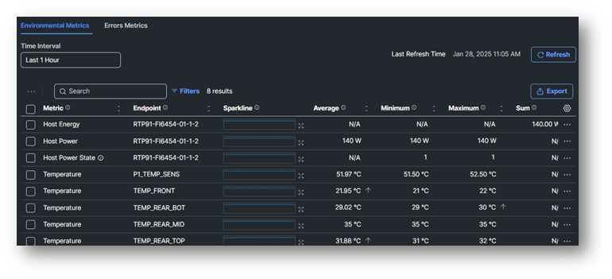
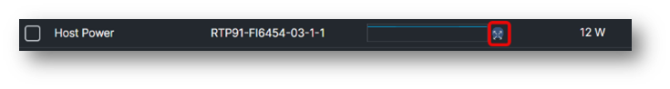
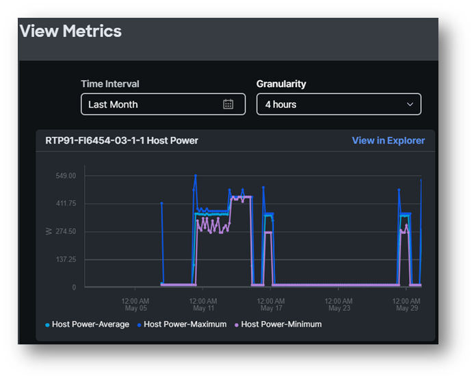
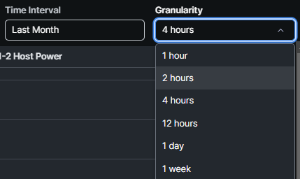

# Task 1: Server Metrics

Each Compute device has certain metrics. 

Let’s go back to **Servers** and select your server.

On the bar, you see **Metrics**. Click it.

Here you see the **Host Power** and **Temperature** of the server.

Click on the icon next to the mini graphic of Host Power

An exploded view is now visible.
Change the setting to **last month**.

The granularity for a Time Interval of “Last Month” can have the following values:

When the Time Interval is set to “Last 1 Hour”, 1min and 10 min Granularity is possible.

The 1 min needs an **IMM Advantage license**.