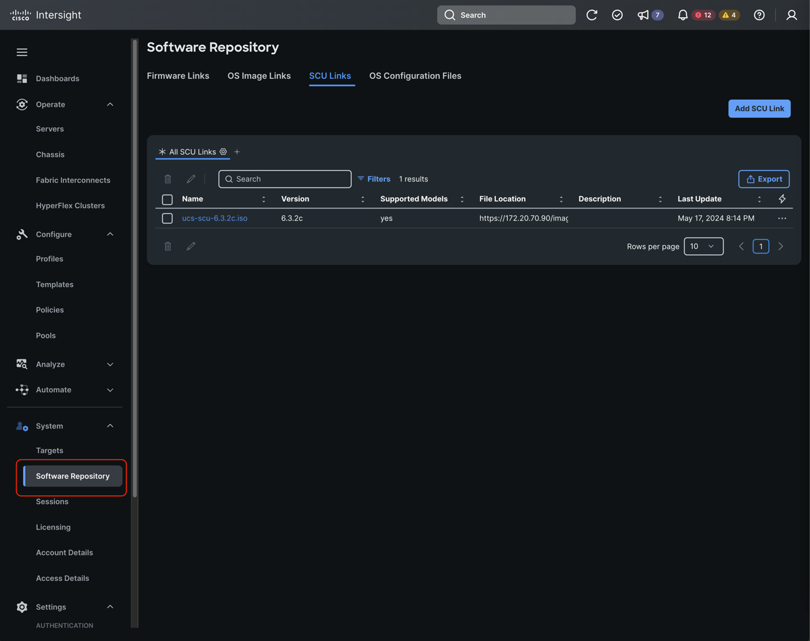
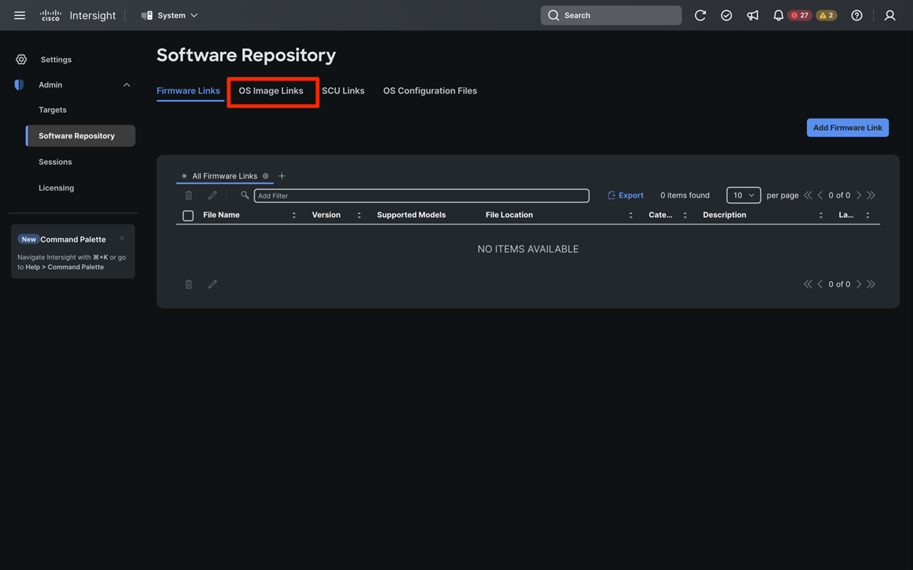
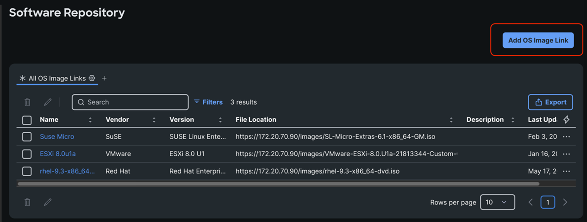
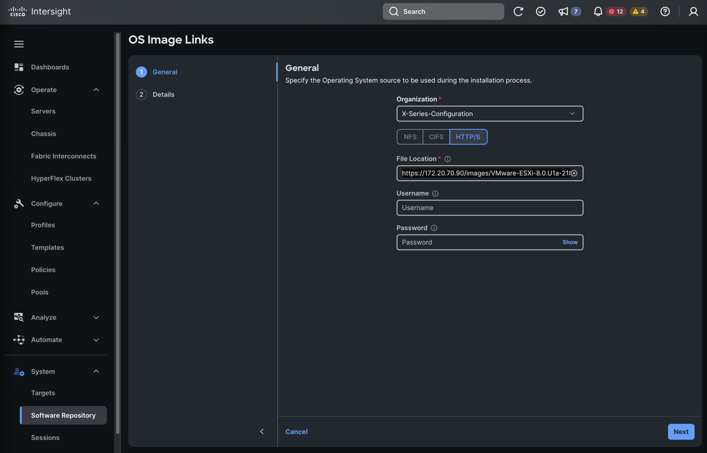
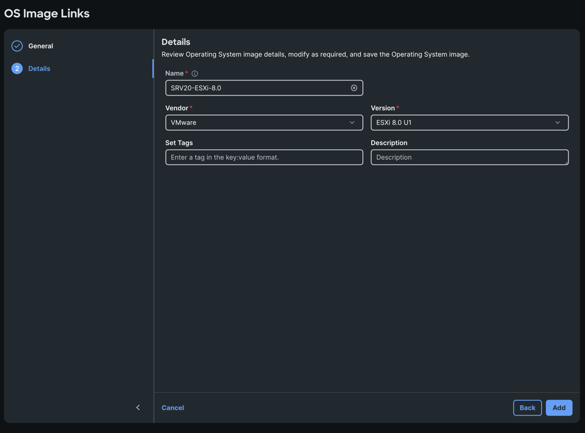
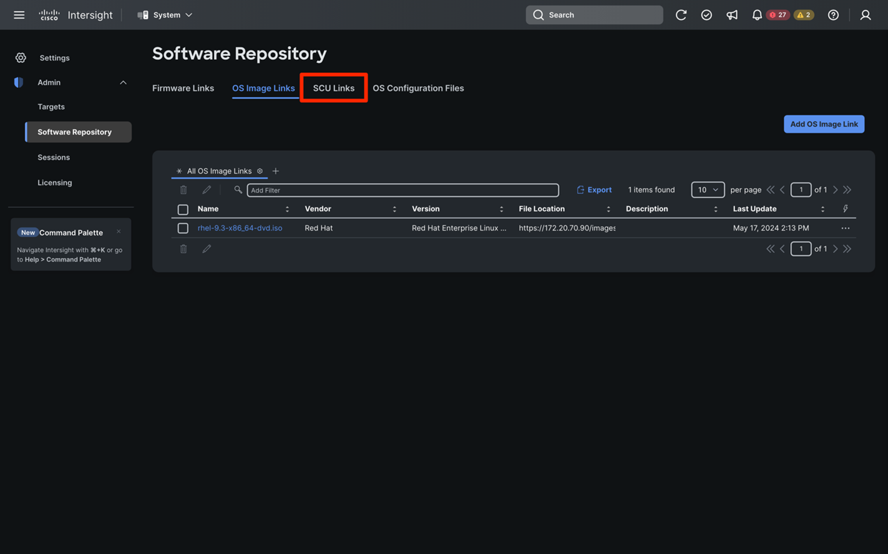
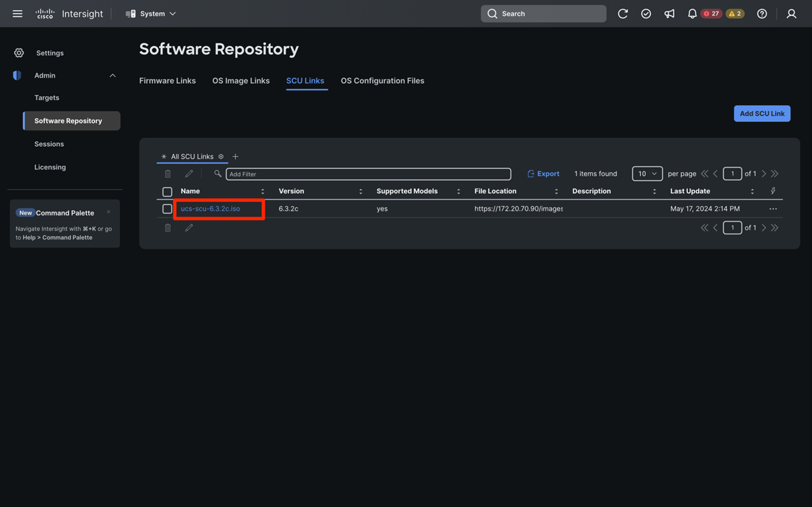
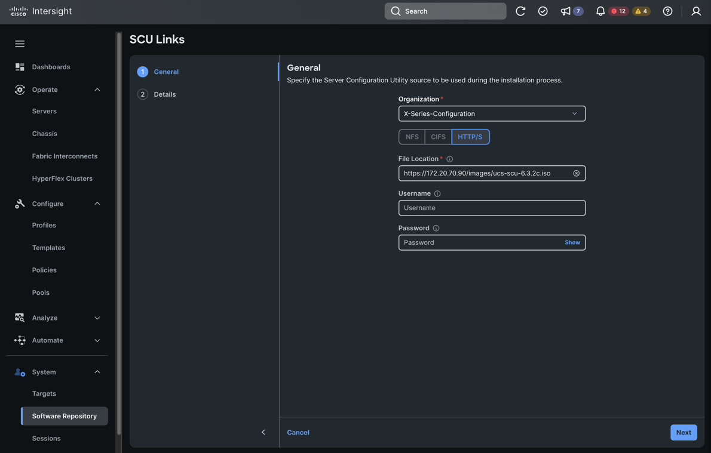
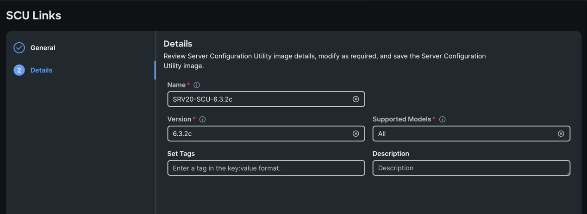

# Repository

In this lab activity, we’ll learn about using Cisco Intersight to perform operating system (OS) installations, including some of the options when performing operating system installs and some of the best practices.

Before we dive into performing an OS installation, allow us to provide a bit of information on how OS installation works with Intersight.

OS installation takes place using UCS vMedia feature and is completely automated by Intersight. There are two images that are required to perform the operation…

**OS image**: This is the OS image (ISO file) that you are intending to install

**Server Configuration Utility (SCU)**: This is a utility provided by Cisco that enables automated unattended OS installation (i.e. OS customization using a configuration file such as a kickstart file during installation)

Both images above should be hosted on an image repository (shared via CIFS, NFS or HTTPS) which the target servers being imaged can access over the network. We’ll see this image repository in just a bit as we perform an OS installation.

There are three main modes (or options) for OS install depending on your requirements. Selecting a mode tells Intersight where to get the configuration file that will be used to create a unique configuration on the server, such as a kickstart file for Linux-based operating systems. Here is a bit more information on each mode:

**Cisco Mode**: Simplest approach for getting started with OS installation and Intersight. For supported operating systems Intersight provides an out of the box validated template to use for the configuration file. This is the quickest way to get an OS up and running, however you cannot edit the provided configuration files.

**Custom Mode**: This mode is similar to the Cisco mode, however it allows the user to upload a customized configuration file to use for unattended OS configuration during install. You can add your own variables and configuration parameters to further customize the OS to your requirements. You will use this mode during your OS installation operation.

**Embedded Mode**: This mode assumes the file or files necessary for OS configuration are embedded within the ISO image, therefore there is no external configuration file required.

As mentioned above, we need to make sure we have both the OS image and the SCU image available on a repository (shared via CIFS, NFS or HTTPS) and we need to make sure Intersight is aware of this repository.

In Intersight, Click on **System -> Software Repository**

The “Software Repository” page is where we can tell Intersight where to find various types of images and files such as firmware, OS, SCU and configuration files. In the case of OS installation, we’ll look at both the OS images and the SCU images.

Click on the “**OS Image Links**” tab.

On the “OS Image Links” tab, we can see that we already have an OS image configured which we’ll use for the OS installation. However, for practice we will add the same OS image again so you get familiar with the steps.

Click on **Add OS Image Link**

Select the **X-Series-Configuration Organization**

Select the **HTTP/S** option

Enter this File Location: https://172.20.70.90/images/VMware-ESXi-8.0.U1a-21813344-Custom-Cisco-4.3.1-a.iso

Click **Next**
Enter the following details

Name: **SRVx-ESXi-8.0** 
Vendor: **VMware**  
Version: **ESXi 8.0 u1**

And click **Add**

Simply observe the information provided for the OS image, it’s simply which protocol is the image shared over (CIFS, NFS or HTTPS) and the location of the image on the fileshare on the network. Please **DO NOT EDIT** this OS image as this will be used for all attendees in the lab.

Now we’ll observe the SCU image as well. Click on “Software Repository” in the left-hand menu.

Now click on the “**SCU Links**” tab.

You can see there already is a link to an SCU image and that is what you will use in the next steps. However, we will create a new link so you can learn important aspects when creating the link.

Click on **Add SCU Link**

Select the **X-Series-Configuration Organization**

Select the **HTTP/S** option

Enter this File Location: **https://172.20.70.90/images/ucs-scu-6.3.2c.iso**

Click **Next**

Name: **SRVx-SCU-6.3.2c**
Version: **6.3.2c** (this is mandatory but not used yet, so what you enter doesn’t matter)
Supported Models: **All** (this is mandatory but not used yet, so what you enter doesn’t matter)

Click **Add**