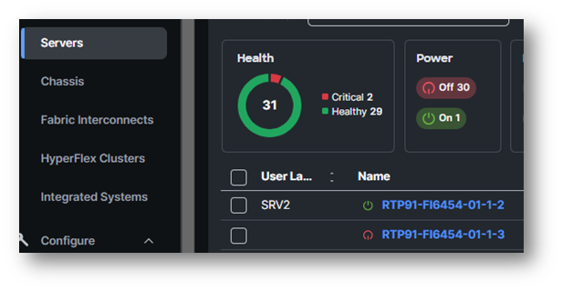
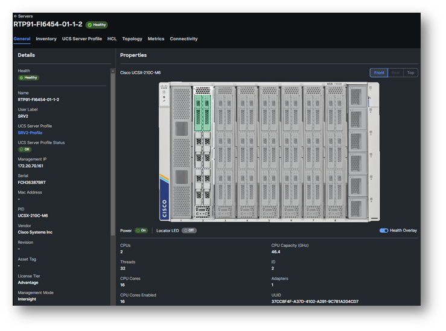
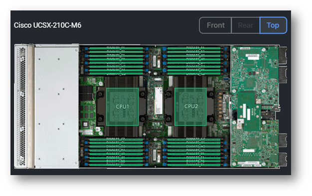
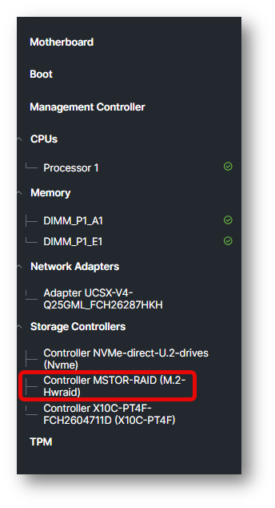
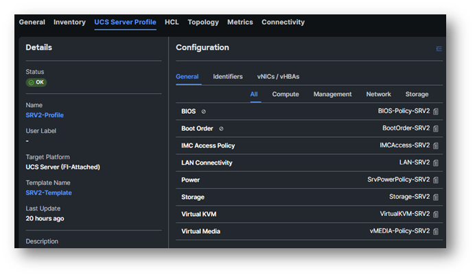
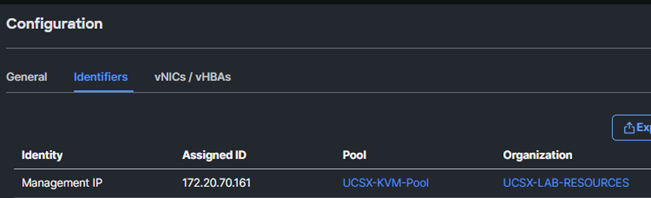
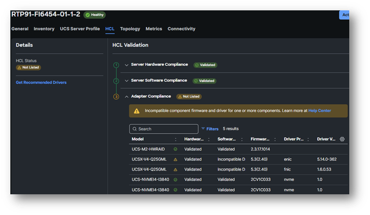
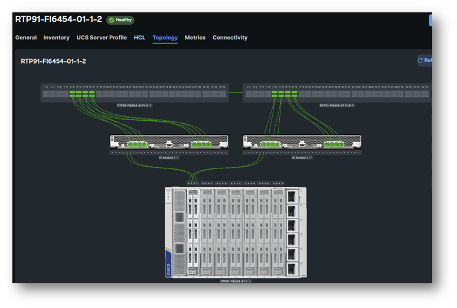
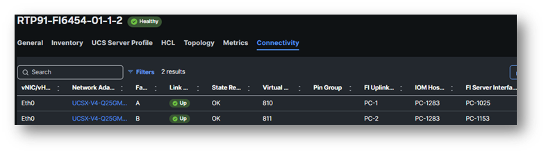

# Server Inventory

Before we dive into the server inventory, please go to Servers and click on **your assigned server**.
In this example we are going to look at SRV-2 or RTP91-FI6454-01-1-2

Click on your assigned server to view the inventory.

At the **General Tab**, you will information about the server, like the serial number, number of CPUs with the Cores, Memory, PID, Firmware version, Alarms and much more.

It is always nice to look at the inside of the server. 
Virtually that is possible when clicking the **TOP** view.

Click on **Tab Inventory** and **expand all**.

Walk through every option and **verify** if the server has a **M.2 Controller**. This is a must for another task.
Also make note if the server has NVMe Drives (Controller NVME-Direct-U.2 Drives)

If you go to the **UCS Server Profile** (Top Bar), and the server profile is attached to the server, you see the **policies** that are **active** for this server.

When you are doing this part, while the Execution of the workflow isn’t finished yet, you will see the status Validating and maybe a “Activate Requires Reboot” after the policy. This is normal behaviour.

Look at which IP address the Management IP of the server did get:

And here is a view of the vNICs/vHBAs that are configured for the profile.  
** If you have vHBA, here you can find the WWPN ID’s for the SAN.

Here is an **example** of the **HCL Validation**. It is possible **your view** is **different**, because this server was configured a bit differently and has an OS installed with incompatible drivers.

The **Topology view** shows the **connections** between the FI, IFM and the node with vNICs (If configured).

Currently, we are skipping the Metrics part. 
There is a Task which walk-through the different Metrics in Intersight.

The **connectivity Tab** shows *information* about the node, vNIC, Adapter, Virtual Group, etc.

