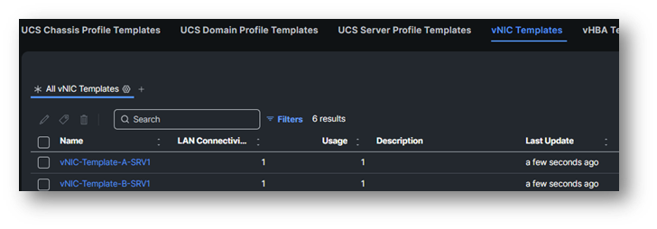
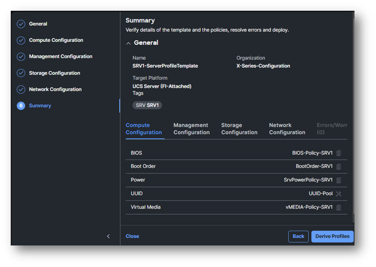

# Task 3: Change the UCS Server Profile Template

As we already mentioned, Pools cannot be cloned. During the cloning of a Server Template Profile a new pool will be created, but without any UUID, MAC, IP, Etc in it.

First, let’s go to **Templates** (Left) and select the **vNIC Templates Tab**.

You have two vNIC templates created.

If there is a vNic template which is not in use, we need to fix the link to the vNic Template.
You can identify which vNic needs to be fix by looking at the usage column.

If both of your vNIC-Template profile has a usage of 1, still follow the steps, just to understand the steps in case you need it in the real world.

Go to Policies and find the LAN-SRVxx policy -> Click on edit -> Next.
Find the vNic which is not linked and click on the 3 dots behind it and link it to the correct vNic Template

**Do not** click on “Detach from Template”.

Follow the steps on the screenshot below:

Then click **Update** and **Save**

Now that we’ve fixed the link to the vNic template we can continue with the next steps.

Go to the **vNic Template** page.
Click the three dots on the right next to one of your vNIC-Template and select **Edit**.
It is better to start with vNIC-Template A.

Click **Next**

Click on the Bin of the Selected Pool.

Select Pool and select **MAC-Pool** of the Shared Pool with Org **UCSX-LAB-RESOURCES**

Click **Save**

**Repeat** these steps also for the vNIC-Template-B-SRVxx, where X is your POD number.

Go to the Templates tab on the left.

**Select** the **UCS Server Profile Templates Tab**.

The Server Profile Template was cloned and thing should first be corrected, before we can derive the Server Template Profile.

Click on **Edit** next to **your** cloned **Server Profile Template**.

Click **Next**.

Click the **Bin icon** next to the **Selected UUID Pool**.

Click **Select Pool** and select **UUID-Pool** from the Shared Pool with Organization UCSX-LAB-RESOURCES.

Click **Next**

Click the **Edit Pencil** of **IMC Access**

Click **Next**

Click on the **Bin icon** next to the **Selected IP Pool**.

Click on **Select IP Pool** and select **UCSXKVMPool** from the Shared Pools with Organization **UCSX-LAB-RESOURCES**

This is the result:

Click **Save**

Click **Next** and click again **Next**.
Click **Next**.

You are now at the **Summary** of the **Server Profile Template**.

Click **Close**.