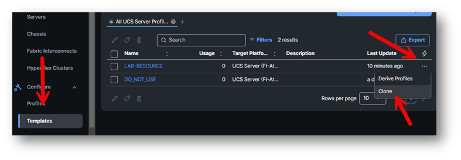
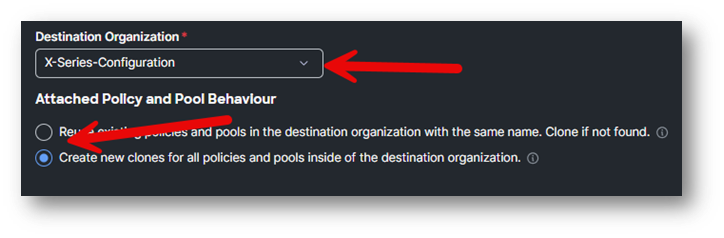
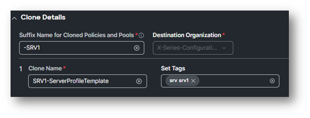
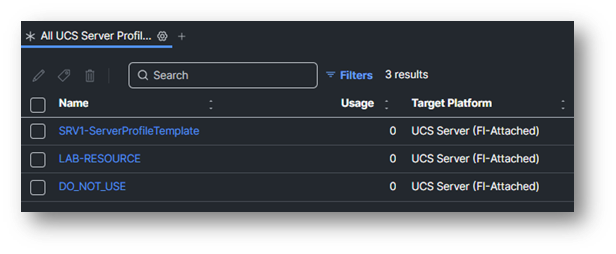

# Task 1: Cloning

Let’s start with creating a clone of the **LAB-RESOURCE** UCS Server Profile Template.
Go to **Configure -> Templates** on the left and select the **UCS Server Profile Templates** at the top.
Click **Three dots** on the right of LAB-Resources and select **Clone**.

The destination Organization is X-Series-Configuration
Select “Create new clones for all policies and pools inside of the destination organization.”

Click Next

Suffix Name for Cloned Policies and Pools should be **-SRVxx**, where **x is your pod number**.

The clone name can be SRVx-ServerProfileTemplate, where **x is your pod number**.
Set Tags to SRV:SRVxx, **where x is your pod number**.

Click **Clone**

The process of creating the clone is about 10 seconds.
Now you see the new UCS Server Profile Template that you can work with.

