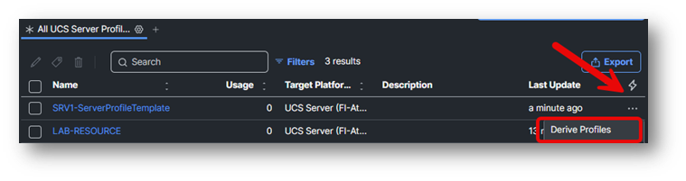
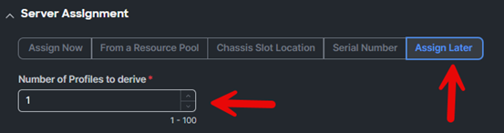
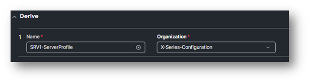
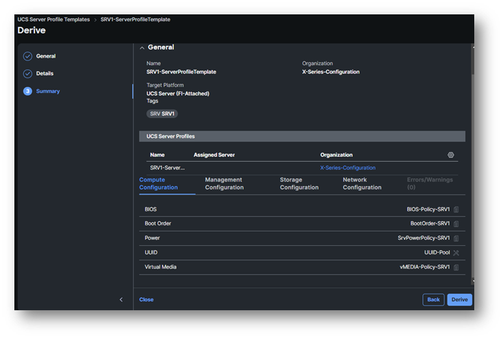
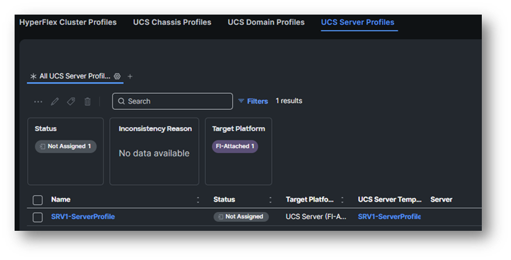

# Task 4: Create UCS Server Profile from Template

Select the three dots on the right of you newly create UCS Server Profile Template and select **Derive**.

Do not assign it to a server and select **Assign Later**.

The **Number of Profiles** to derive should be “**1**” and click **Next**.

Rename it to: **SRVxx-ServerProfile**, where **x is your POD number** and the **Organization** is **X-Series-Configuration**.

Click **Next**.

You see now the summary.

Click on **Derive**

Go to **Profiles** (Left) and select **UCS Server Profiles**.

Look at the newly create UCS Server Profile.

You will see **SRVxx-ServerProfile** at the **Profiles / UCS Server Profiles**.

NOTE:

**We won’t assign the Server Profile because we will use Intersight Automation to do that!**