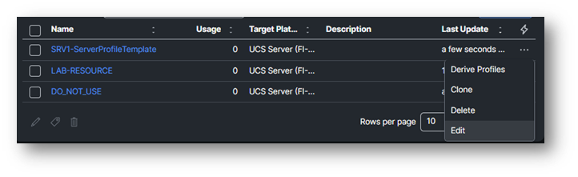
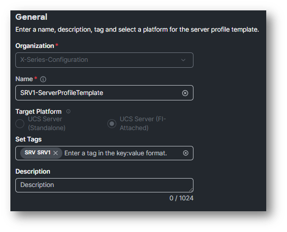
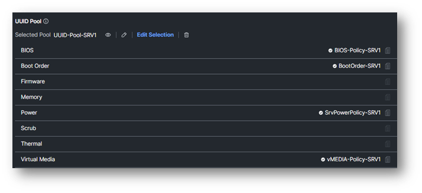

# Task 2: Verify the newly created clone

Select the three dots on the right and select **Edit**.

The view when Edit is clicked.

Just verify that the Organization is X-Series-Configuration.
Click **Next**.

Verify if the policies that you see has the extension of **-SRVx**, where x is your pod number.

Click **Close**