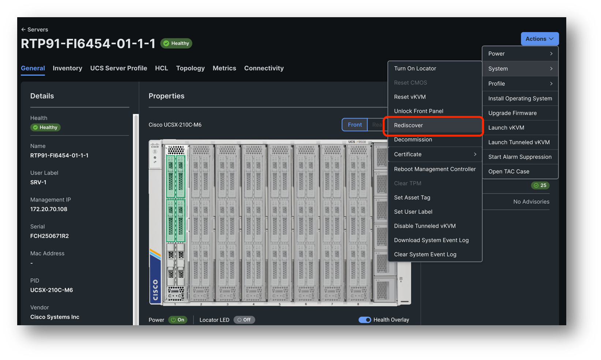

# Task 3: Blade Rediscovery

Your server is in a good state and fully discovered in Intersight. Unfortunately – or luckily – we did not find a way to remove parts of the inventory so we can’t simulate an incorrectly discovered server but we will go through some of the step to rediscover your server. This is a non-disruptive operation and safe to try first.

Go to your server and then click on Actions -> System -> Rediscover

This will initiate a Blade Discovery and this is the first step to fixing your server.
Monitoring the ping and the Discovery workflow to see if you observe any disruptions – there should be none.

The discovery will take about 4 minutes, monitoring the workflow to see which steps are taking to understand the impact this workflow might have.