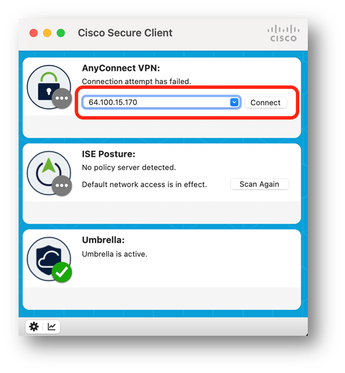
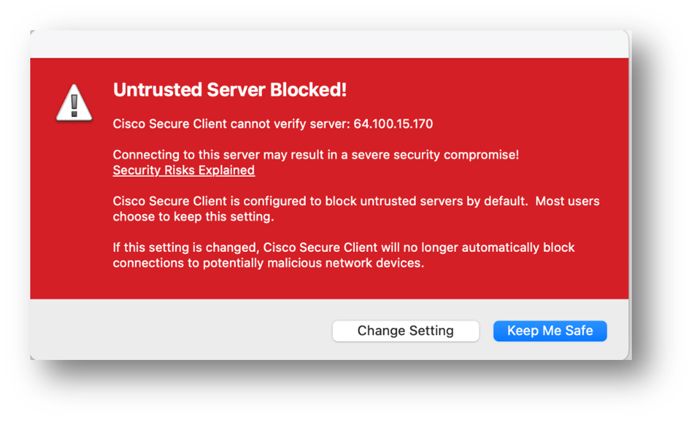
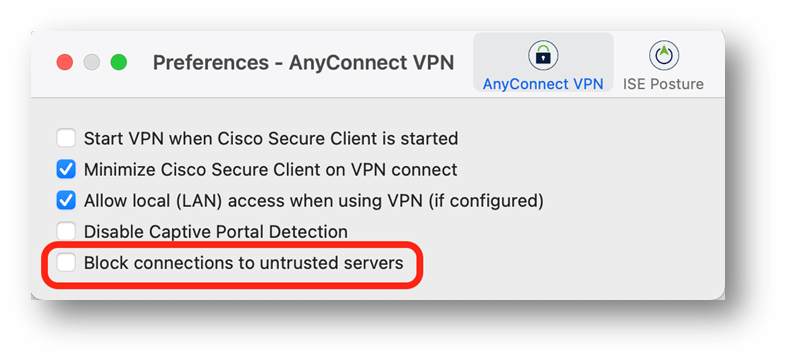
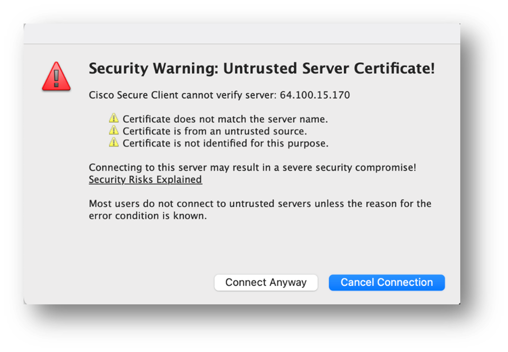
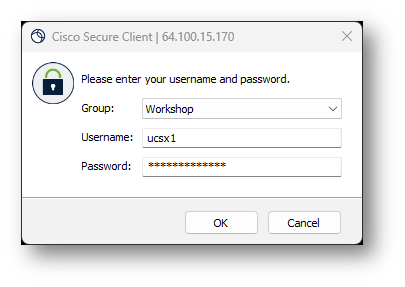
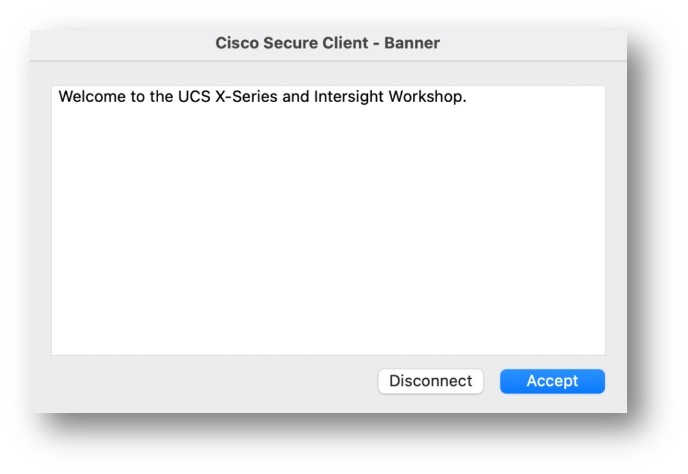

# Task 1: Connect To VPN

This is only required for some tasks, but you might as well set it up now so it’s there when you need it. First open the Cisco Secure Client and connect to [[VPN IP]].

When you try to connect you could be presented with this screen:

That means you will need to stop blocking untrusted servers.
Please click on “Change Settings”

The disable the “Block connections to untrusted servers” and try to connect again.

Now you will see a warning that our VPN server has an Untrusted Server Certificate, please click on “Connect Anyway”.

Choose the “**Workshop**” group and enter your credentials which are the [[Username]] and [[VPN Password]] values from the User Details Worksheet.

**IMPORTANT**: The username is without @intersighttme.com, enter your username like we did below:

You should see this message, don’t forget to click **Accept** and now you have access to the VPN.

