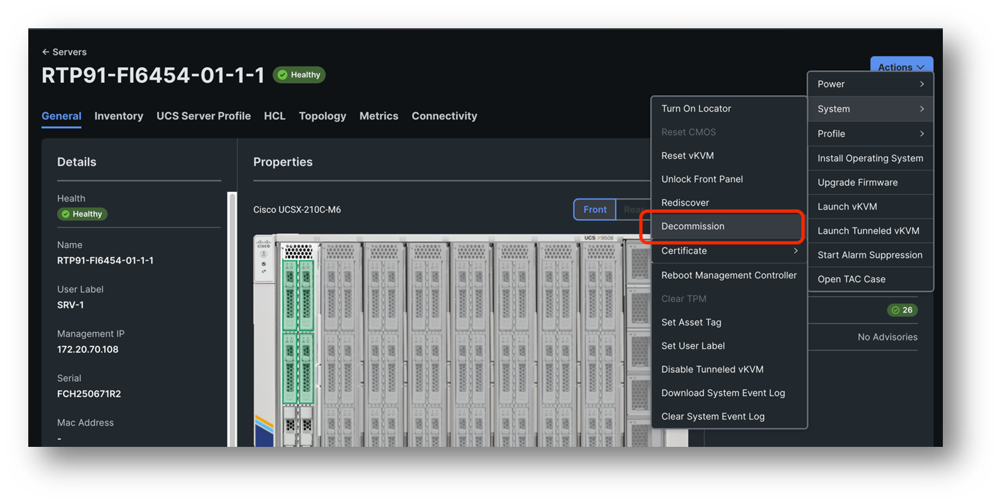
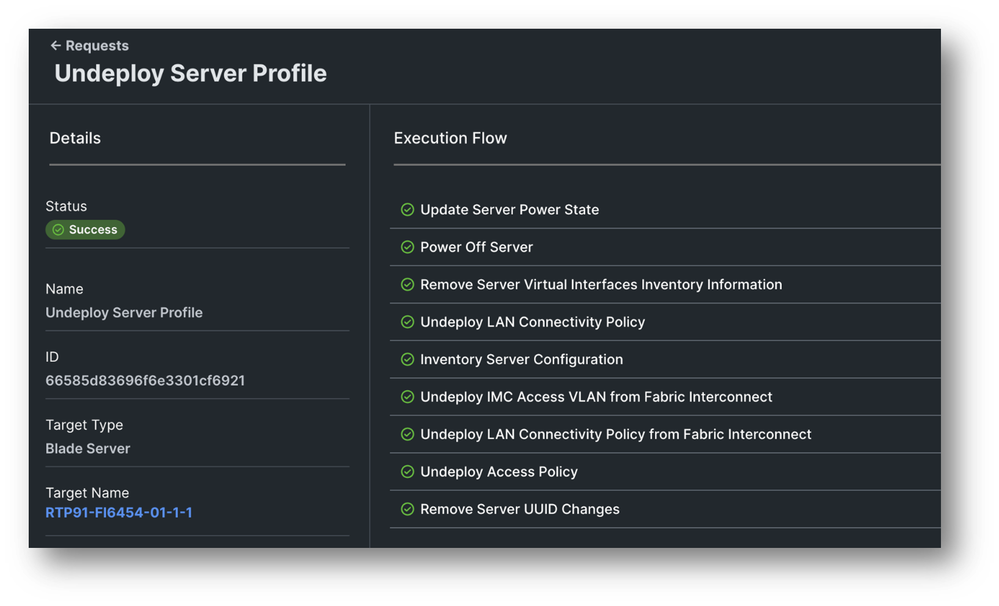
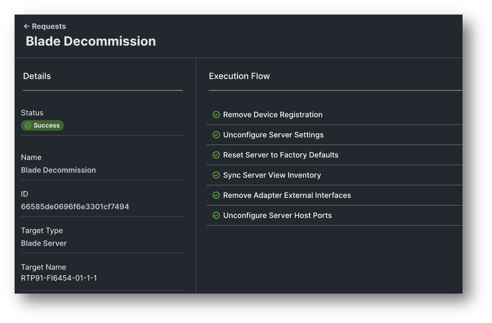
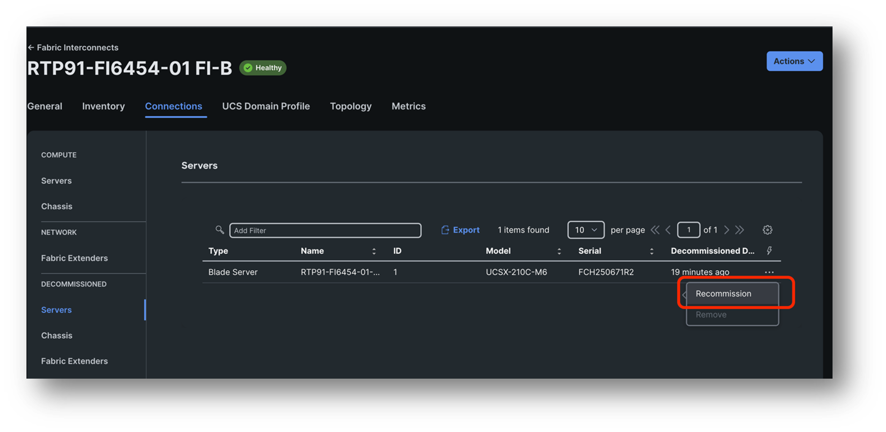
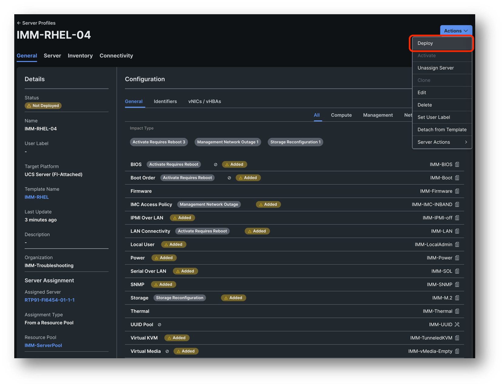
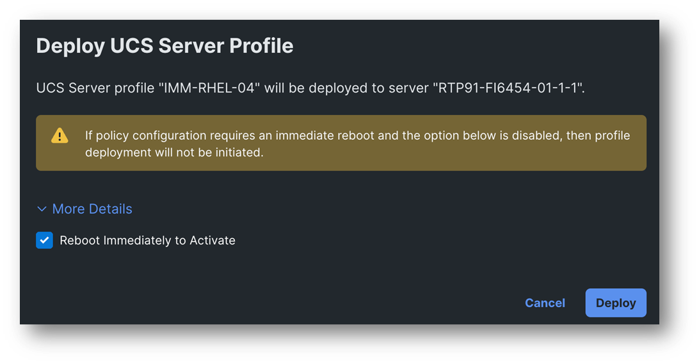

# Task 4: Decommission and Recommission

Sometimes your server still hasn’t discovered correctly, and you might want to do a more thoroughly rediscover. The way how to do that is by decommissioning and recommissioning your server.

Go to your server page and click Action -> System -> Decommission

**Attention! This is a disruptive operation!**  
Read the pop-up message and click on Decommission.
You will see that the server is immediately not pingable anymore. 
The decommission will start with an Undeploy Server Profile Workflow which will clear all the server identifiers like the MGMT ip, MAC address, UUID and turn the server off.

After the undeploy workflow you will see the Blade Decommission workflow.
This will reset the server back to factory defaults and completely remove the device registration in Intersight. That is why sometimes this is also referred to as a Deep Rediscovery

Now if you which to Recommission the server you need to navigate to
Fabric Interconnect -> [[IMM-Domain-Name]] FI-A or B doesn’t matter -> Connections -> Decommissioned Servers.
Find your [[ServerName]] in the list and click the three dots behind it and choose Recommission

Accept the pop-up and you will see that the server is removed from the list of Decommissioned servers but is not yet in the Server list.

This will take about a minute or so and then a Blade Discovery will start. This Blade discovery will take longer as the server needs to boot. This might be a good time to get a fresh cup of coffee as it will take about 10 minutes.
When the Blade Discovery is finished you will see that a Server Profile has already assigned itself to your server. You can find the Server Profile by going to:

Server -> [[ServerName]] -> UCS Server Profile -> Click on the Name of your Server Profile.

All you got to do now is deploy that Server Profile again by clicking on Action -> Deploy

Select “Reboot Immediately to Activate” and click on Deploy

The Deploy Worfklow will take about 7 minutes. When it’s finished the server will need to boot so enjoy another 10 minute break and feel free to talk to us while you wait.