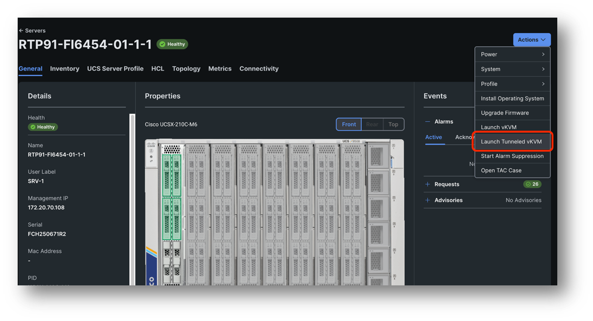
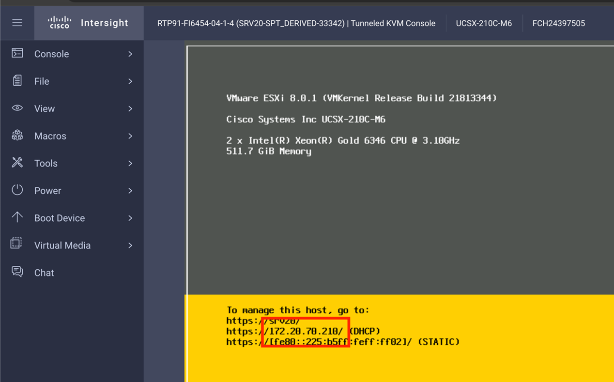
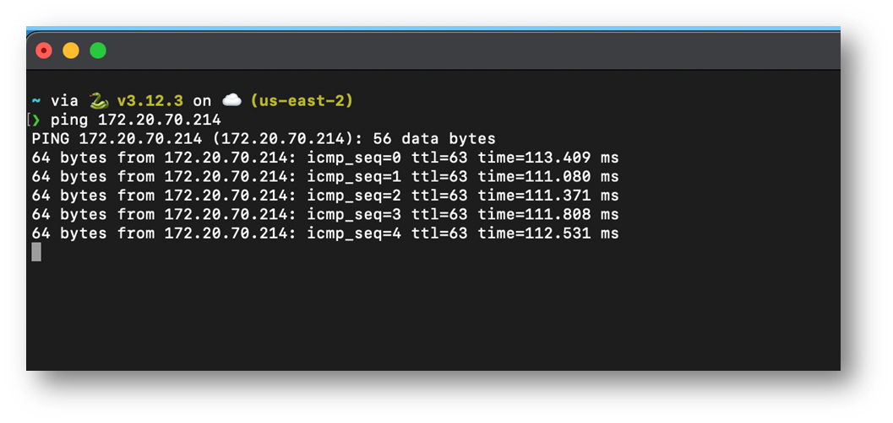

# Task 2: Get The OS IP And Start A Ping

Launch the **Tunneled vKVM** by navigating to your Servers -> Actions -> Launch Tunneled vKVM

If you still have the tab open you can skip this step.

When you are on the vKVM page you will see the IP address that is automatically assigned to your ESXi host through DHCP

Open a terminal on your workstation and ping the IP address

Keep this ping running during all tasks in this scenario.