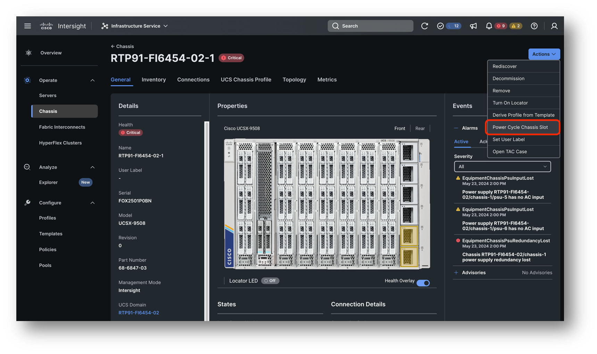
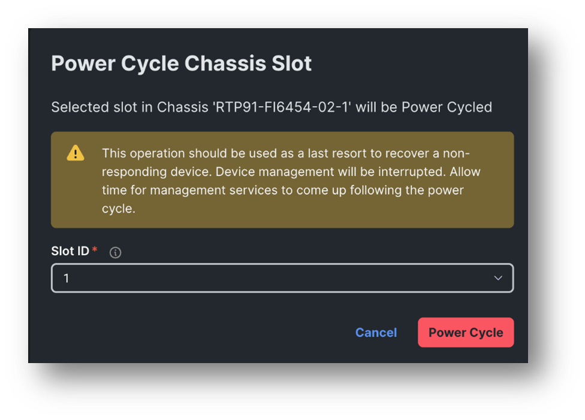

# Task 5: Power Cycle Chassis Slot

This operation can save you a trip to the datacenter when your server is not showing up in the chassis or when the server is non-responding to any operations.

Instead of reseating the server in the slot you can try to power cycle the chassis slot and see if this helps.

**NOTE**:  
! Before you do this step make sure that all workflows for your server are finished !

In order to reset the chassis slot you must go to 
Chassis -> [[Chassis Name Of Your Domain]] -> Click on the Chassis in the details section -> Actions -> Power Cycle Chassis slot

Select the right slot for your server, which is **the last digit of your [[ServerName]]**.

**ATTENTION! This is a disruptive operation, your server will reboot.**

When you hit Power Cycle the server will power off.

After the Chassis Slot power cycle is complete make sure to power your server on again by going to Server -> [[ServerName]] -> Actions -> Power -> Power On