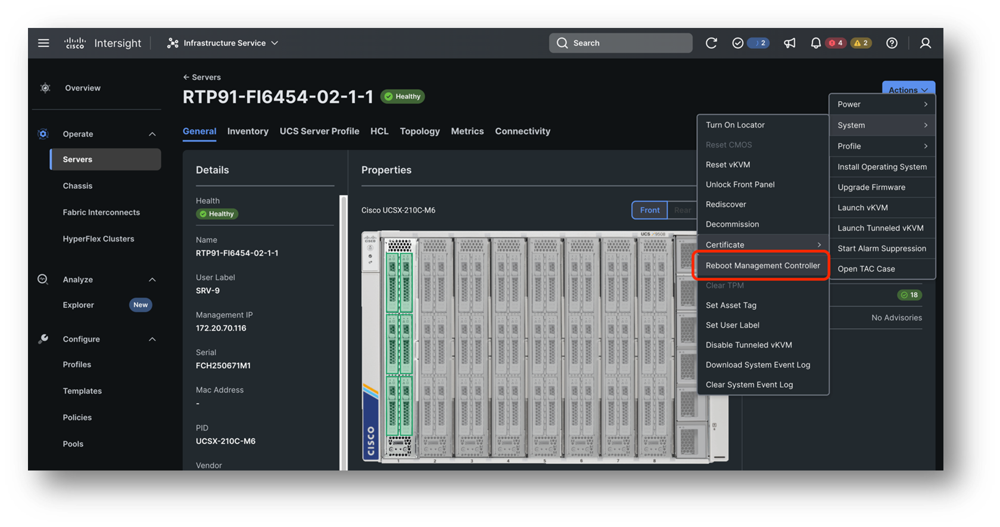

# Task 6: Reboot Management Controller

Another common troubleshooting step is to reset the management controller of your server. This may be needed when you server is showing certain errors that seem non persistent. The reboot of the management controller is non disruptive.

Before you do this step make sure that all workflows for your server are finished.

To reboot your management controller go to  
Servers -> your Server -> Actions -> System-> Reboot management controller

This will kick off a workflow and a subsequent Blade Discovery workflow.
You can monitor the ping the see that there is no impact to your Operating System.