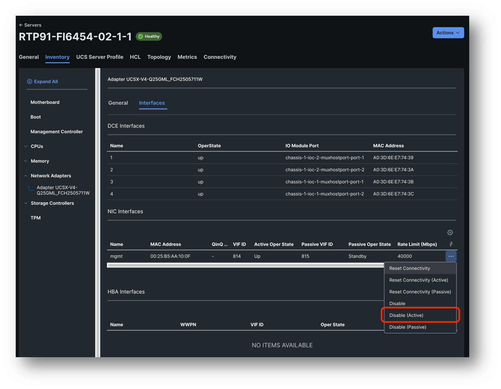
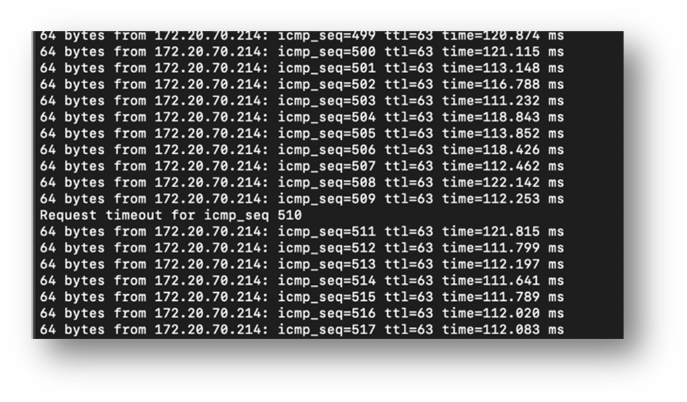
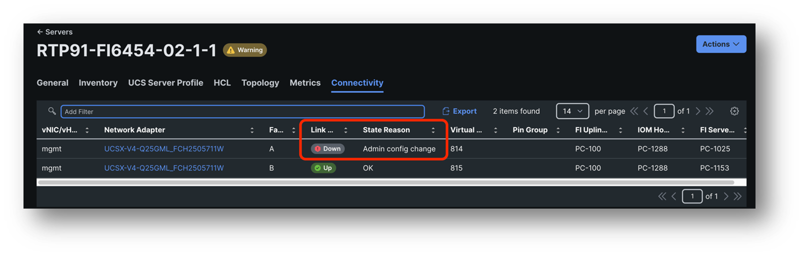
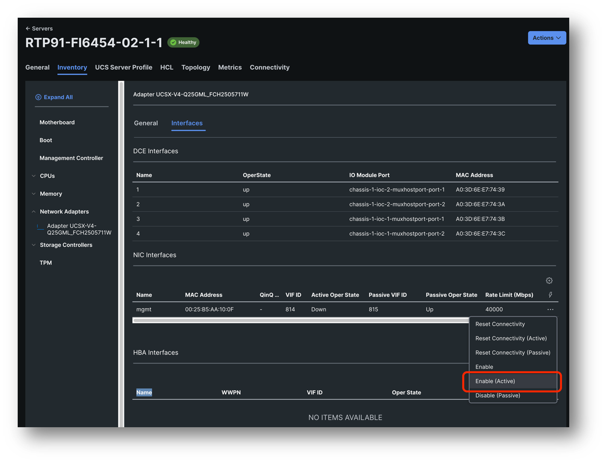

# Task 7: Testing VNIC Failover

Go to Servers -> [[ServerName]] -> Inventory -> Network Adapters ->  UCSX-V4-Q25GML -> 
Interfaces -> Click on the three dots behind mgmt - > Disable (Active)

Now look at the ping and see that you might have lost just 1 ping

Go to the Connectivity tab and you will see that 1 uplink of the vNic is down, this might take some time, make sure to refresh the page after 1 minute.

Go back to your vNic and enable it again

Using the vNic Enable / Disable methods and the Connectivity tab allows you to force certain traffic to go over a specific FI, which can help in troubleshooting networking issue.